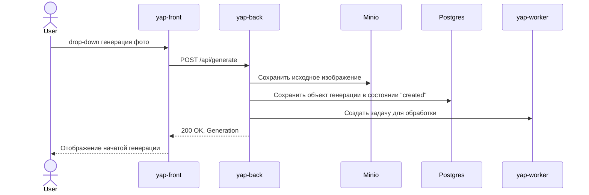
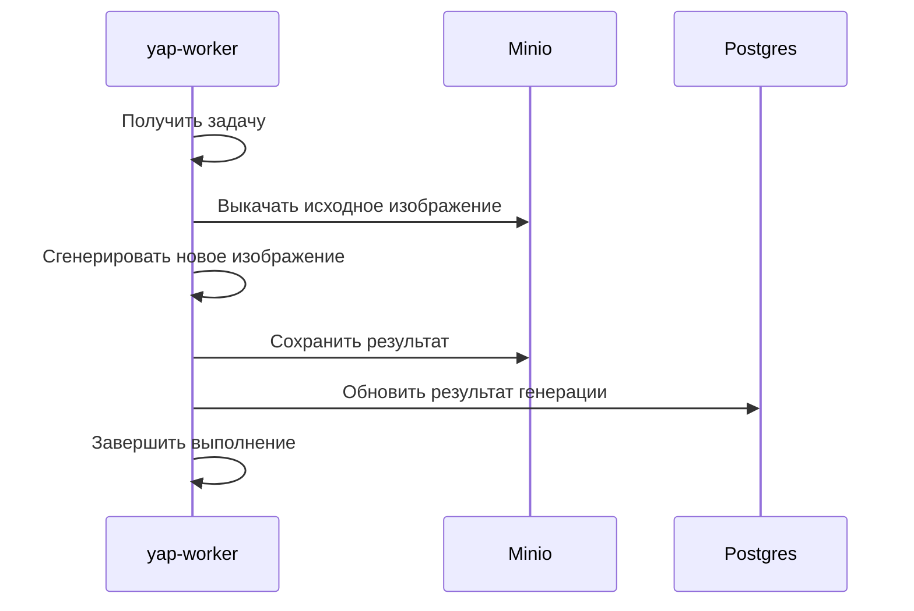
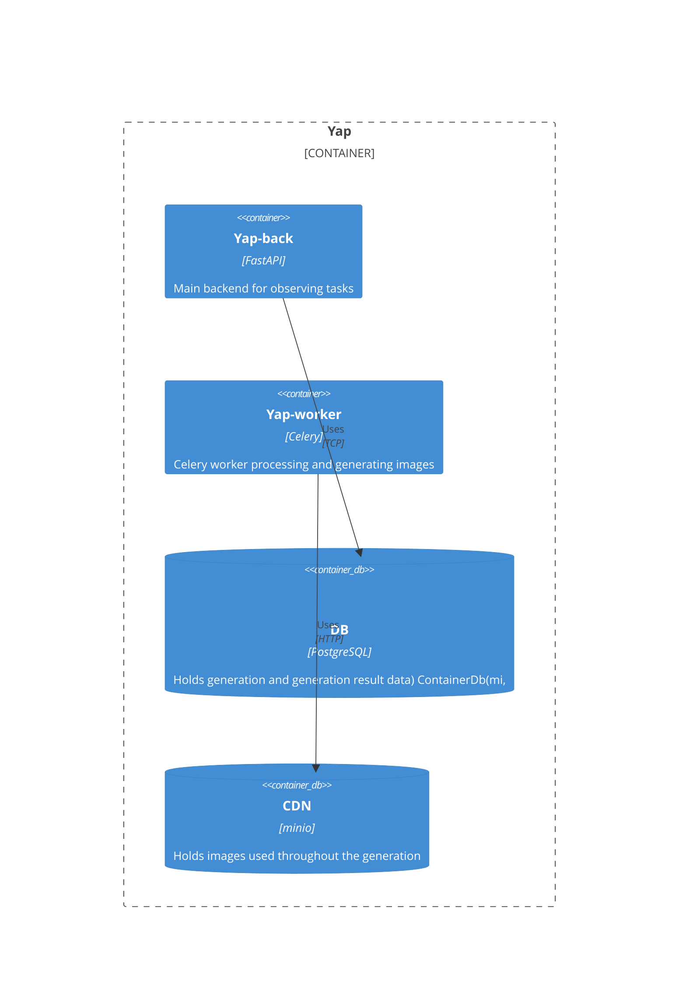

# YAP/YAWT/YAHT

Инициализация задачи на генерацию

```mermaid
sequenceDiagram
    actor User
    User->>yap-front: drop-down генерация фото
    yap-front->>yap-back: POST /api/generate
    yap-back->>Minio: Сохранить исходное изображение 
    yap-back->>Postgres: Сохранить объект генерации в состоянии "created"
    yap-back->>yap-worker: Создать задачу для обработки
    yap-back-->>yap-front: 200 OK, Generation
    yap-front-->>User: Отображение начатой генерации
```

Обработка задач на генерацию

```mermaid
sequenceDiagram
    yap-worker ->> yap-worker: Получить задачу
    yap-worker->> Minio: Выкачать исходное изображение
    yap-worker->>yap-worker: Сгенерировать новое изображение
    yap-worker->>Minio: Сохранить результат
    yap-worker->>Postgres: Обновить результат генерации
    yap-worker ->> yap-worker: Завершить выполнение
```

Система целиком

```mermaid
    C4Context
    Container_Boundary(cb0, "Yap") {
        Container(yb, "Yap-back", "FastAPI", "Main backend for observing tasks")
        Container(yw, "Yap-worker", "Celery", "Celery worker processing and generating images")
        ContainerDb(pg, "DB", "PostgreSQL", "Holds generation and generation result data)
        
        ContainerDb(mi, "CDN", "minio", "Holds images used throughout the generation")
        ContainerDb(mi, "CDN", "minio", "Holds images used throughout the generation")

        Rel_R(yb, pg, "Uses", "TCP")
        Rel_R(yb, pg, "Uses", "TCP")
        Rel_D(yw, mi, "Uses", "HTTP")
        Rel_D(yw, mi, "Uses", "HTTP")
    }
```