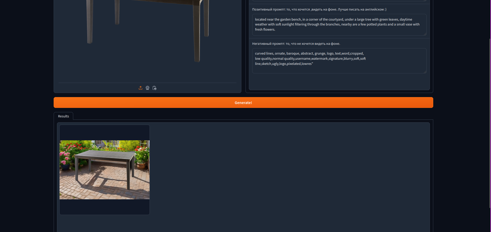

# Запуск пайплайна с моделью
## Docker
С помощью dockerfile можно запустить сервер приложения и обращаться к нему. Бэкенд приложения основан на https://www.bentoml.com/.
Запуск:
```
docker build . -t yaht:0.1
docker run -d -p 3000:3000 yaht:0.1
```
Запуск приложен требует VRAM >= 11Gb.
Далее можно обращаться к модели, передавая ей картинку (в данном случае модель развернута в Yandex Datasphere):
```bash
curl -H "x-node-alias: datasphere.user.bento" \
    -H "Authorization: Bearer <IAM_TOKEN>" \
    -H "x-folder-id: b1gk61tkdst8hqagvopn" \
    -H 'accept: image/*' -H 'Content-Type: multipart/form-data' \
    -F 'image=@inputdata.png;type=image/png' \
    -X 'POST' -F 'description=Подвесное кресло Greengard Лина 86x102.9x76 см искусственный ротанг коричневый' \
    -F 'positive_prompt=located in the modern living room, on the floor, next to the armchair, evening weather, dim blue light, and plants around' \
    -F 'negative_prompt=curved lines, ornate, baroque, abstract, grunge, logo, text,word,cropped,low quality,normal quality, username, watermark, signature, blurry, soft, soft line, sketch, ugly,logo,pixelated,lowres' \
    -F 'num_inference_steps=50' https://node-api.datasphere.yandexcloud.net/replace_background --output image.png
```
Здесь:

```positive_prompt``` - то, что хочется видеть на фоне

```negative_prompt``` - то, то категорически не генерировать на фоне

```num_inference_steps``` - количество итераций генерации Stable Diffusion. Чем больше, тем лучше, но и дольше.

image.png будет результатом обработки.

## Gradio - быстрый фронт
Gradio поможет быстро потестировать решение, поделиться им с другими. Ввиду ограниченности ресурсов, самый простой запуск данного приложения в https://colab.research.google.com.
Достаточно запустить ноутбук notebook.ipynb, далее запустится сервер с пайплайном.
В случае, если доступ к репозиторию есть, то можно пропустить ячейки с генерацией SSH ключа.

Это приложение также можно запускать вне ноутбука, на машине с VRAM >= 11 Gb, командами:
```bash
pip3 install -r requirements.txt

cat degradations.py > /usr/local/lib/python3.10/dist-packages/basicsr/data/degradations.py

python3 app.py
```

После запуска откроется сервер в интернет. Например, https://cf0a03d42d2e8d6c9b.gradio.live/ такой.

После перехода на него откроется следующий интерфейс:


Необходимо загрузить картинку, добавить ее небольшое описание и запустить генерацию кнопкой Generate!

Снизу появится сгенерированная картинка:

