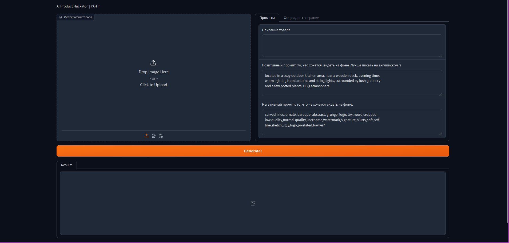

# Запуск пайплайна с моделью
Ввиду ограниченности ресурсов, самый простой запуск данного приложения - https://colab.research.google.com.
Достаточно запустить ноутбук notebook.ipynb, далее запустится сервер с пайплайном.
В случае, если доступ к репозиторию есть, то можно пропустить ячейки с генерацией SSH ключа.

Это приложение также можно запускать вне ноутбука, на машине с VRAM >= 11 Gb, командами:
```bash
pip3 install -r requirements.txt

cat degradations.py > /usr/local/lib/python3.10/dist-packages/basicsr/data/degradations.py

python3 app.py
```

После запуска откроется сервер в интернет. Например, https://cf0a03d42d2e8d6c9b.gradio.live/ такой.

После перехода на него откроется следующий интерфейс:


Необходимо загрузить картинку, добавить ее небольшое описание и запустить генерацию кнопкой Generate!

Снизу появится сгенерированная картинка:

